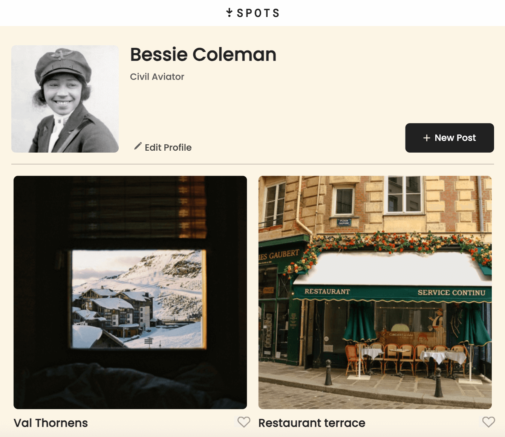

# Project 3: Spots

### Overview & Skills

- HTML & CSS
- Grid Layout / BEM naming conventions
- Javascript
- Responsive Web Design : Working with design briefs
- Webpack / JSON
- API & Validation

**Intro**

This site is a social media platform for displaying images. Visitors to a profile page can like images using the heart icon.

This project is made so all the elements are displayed correctly on a varity of popular screen sizes. This project was created from a Figma design brief. Images and fonts were gathered from design brief.

This project was created iteratively. Initially, I developed the HTML and CSS working off of a design brief. Later, I used Webpack and API to improve the functionality of the project.

**Figma**

This project was created using a Figma design brief. All fonts, sizing, and styles were integrated into the code using HTML & CSS.

- [Link to the Figma design specifications](https://www.figma.com/file/BBNm2bC3lj8QQMHlnqRsga/Sprint-3-Project-%E2%80%94-Spots?type=design&node-id=2%3A60&mode=design&t=afgNFybdorZO6cQo-1)

**Images**

Images were imported directly from Figma. All images and icons were optimized with [tinify](https://tinypng.com/).

This project was created for Sprint 3 through 10 in the Triple Ten Bootcamp. Images can be added to the Spots user page by pasting a URL into the new post modal and adding a description. The images are stored on a server and retrieved using APIs.

Plans for improving project: This project will be updated with additional information and Javascript code in the coming Sprints in Triple Ten Bootcamp.

### Images & Video

The Sprint 3 iteration of the project, video description and walk-through, can be found here: [Link to SPOTS video](https://drive.google.com/file/d/1d2t9qON0h8EUUb1FiXnrPtg8CA1rIRuY/view?usp=sharing)

The Sprint 9 iteration of the project, video description and walk-through, can be found here: [Link to SPOTS video](https://drive.google.com/file/d/1Ku6w68qhvqUJCbCdmXeU15J7eIWt95mB/view?usp=drive_link)

<!-- The web page display at a width of 1440px:

The web page display at a width of 890px:

The web page display at a width of 320px:
 -->
